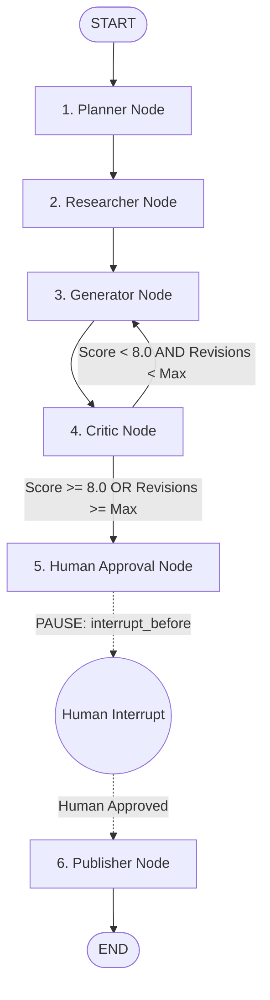

# Week 5 Day 3 — LangGraph: Stateful, Multi-Step & Cyclical Agent Workflows

**Author:** Shayaan  
**Date:** Week 5, Day 3  
**Stack:** Python 3.12+ · LangGraph 1.2.9 · LangChain Core 1.5.0 · ChatAnthropic · MemorySaver  

---

## 1. Graph Concepts & State Architecture

Unlike traditional `AgentExecutor` loops which rely on a monolithic while-loop around tool calling, **LangGraph** models agentic systems as directed graphs of state transitions. This provides fine-grained control over execution flow, state persistence, branching, and cyclic refinement.

### Core Building Blocks

| Building Block | Description | Analogy |
|---|---|---|
| **`StateGraph`** | The primary graph builder parameterized by a State schema. Compiles into an executable Runnable graph. | The blueprint / factory |
| **`State`** | A shared `TypedDict` or `Pydantic` schema representing the global state object passed to every node. | The single source of truth |
| **`Nodes`** | Python functions `(state: State) -> dict` that receive current state and return partial updates. | Workers / Processing steps |
| **`Edges`** | Hardwired directional connections dictating static node-to-node transitions. | Fixed conveyor belts |
| **`Conditional Edges`** | Router functions `(state: State) -> str` that evaluate state to dynamically determine the next node. | Switches / Railway junctions |

### Shared State Schema (`ResearchState`)

```python
class ResearchState(TypedDict):
    topic: str               # Original research query
    target_audience: str     # Audience level (e.g. Executive, Technical)
    plan: list[str]          # High-level steps generated by Planner
    research_notes: list[str]# Ground-truth data extracted from tools
    draft: str               # Current version of the generated report
    critique: str            # Feedback from Critic node
    quality_score: float     # Quality score (0.0 to 10.0) evaluated by Critic
    revision_count: int      # Loop-back counter to enforce max_revisions
    max_revisions: int       # Hard upper limit on revision attempts
    is_approved: bool        # Human-in-the-loop approval flag
    final_output: str        # Formatted final report ready for publication
```

---

## 2. Graph Topology & Workflow Diagram

The workflow implements an **Autonomous Technical Research & Revision Agent** equipped with automated quality evaluation, revision looping, human approval interrupts, and publication formatting.



### ASCII Flow Architecture

```
                  ┌─────────┐
                  │  START  │
                  └────┬────┘
                       │
                       ▼
                 ┌───────────┐
                 │  Planner  │
                 └─────┬─────┘
                       │
                       ▼
                 ┌───────────┐
                 │ Researcher│ (Queries products DB / calculator tools)
                 └─────┬─────┘
                       │
                       ▼
                 ┌───────────┐
                 │ Generator │◄─────────────────┐
                 └─────┬─────┘                  │
                       │                        │
                       ▼                        │ Self-Correction Loop
                 ┌───────────┐                  │ (if score < 8.0
                 │  Critic / │                  │  AND rev_count < max)
                 │ Evaluator │                  │
                 └─────┬─────┘                  │
                       │                        │
             Conditional Edge ──────────────────┘
                       │
                       │ (if score >= 8.0 OR rev_count >= max)
                       ▼
              ┌─────────────────┐
              │ Human Approval  │ ──► [INTERRUPT BEFORE] Pauses for human
              └────────┬────────┘
                       │
                       │ (app.update_state: is_approved = True)
                       ▼
                 ┌───────────┐
                 │ Publisher │
                 └─────┬─────┘
                       │
                       ▼
                    ┌─────┐
                    │ END │
                    └─────┘
```

---

## 3. Linear vs. Cyclical Graphs (Self-Correction Loops)

### Why Cyclical Loop-backs are Hard in `AgentExecutor`
In a plain `AgentExecutor`, the control loop is hardcoded: `LLM -> Tool -> LLM -> Tool -> Answer`. Implementing a multi-phase revision loop (Draft -> Evaluate -> Revise -> Re-evaluate) inside `AgentExecutor` requires fragile prompt engineering tricks, custom output parsing, or hacking tool outputs to trigger artificial loops. The agent cannot explicitly track revision counts or route execution to specific sub-chains based on numeric thresholds.

### Why Cyclical Loop-backs are Natural in `LangGraph`
In `LangGraph`, cycles are first-class primitives. A conditional edge evaluates the state after the `Critic` node:
```python
def route_critique(state: ResearchState) -> str:
    if state["quality_score"] >= 8.0:
        return "human_approval"
    elif state["revision_count"] >= state["max_revisions"]:
        return "human_approval"
    else:
        return "generator"
```
The state maintains `revision_count`, which increments on every pass. This guarantees deterministic loop termination while giving the graph full autonomy to refine its output until quality criteria are met.

---

## 4. Human-in-the-Loop (HITL) & Interrupts

### Mechanics of Interrupts
By compiling the graph with `interrupt_before=["publisher"]` and a checkpointer (`MemorySaver`), execution halts immediately prior to executing the `publisher` node.

1. **Pause**: The runner returns, saving a state snapshot to `MemorySaver` under `thread_id`.
2. **Inspection**: `app.get_state(config)` inspects the current state (`next: ('publisher',)`), allowing admins to review the draft report and critique score.
3. **State Mutation**: The human reviewer approves the output via `app.update_state(config, {"is_approved": True})`.
4. **Resume**: `app.invoke(None, config)` resumes execution seamlessly from the paused checkpoint.

### When to Require HITL vs. Full Autonomy

| Dimension | Require Human-in-the-Loop | Permit Full Autonomy |
|---|---|---|
| **Impact Level** | High risk (financial trades, email sending, DB writes) | Low risk (read-only queries, data summaries) |
| **Reversibility** | Irreversible actions (publishing, API post requests) | Idempotent / cached reads |
| **Accuracy Standard**| Zero tolerance for hallucination (legal / medical) | General research / brainstorming draft |
| **Compliance** | Regulated auditing requirements | Internal analytics |

---

## 5. Persistence, State History & Time-Travel Debugging

`MemorySaver` acts as a thread-scoped checkpoint manager. Every state transition produces a checkpoint indexed by `thread_id` and a unique checkpoint ID.

### Time-Travel Capability
Using `app.get_state_history(config)`, developers can:
- Inspect historical snapshots of state at any point in the multi-step execution.
- Fork execution from an earlier checkpoint to test alternative prompts or state edits.
- Debug exact failure points in complex multi-agent runs without re-executing early nodes.

---

## 6. Comparison: `AgentExecutor` vs. `LangGraph`

| Metric / Feature | LangChain `AgentExecutor` | LangGraph |
|---|---|---|
| **Control Flow** | Monolithic while-loop around tool calling | Expressive Graph (Nodes + Edges + Cycles) |
| **State Management** | Implicit string message list | Explicit, typed shared State dictionary |
| **Multi-Step Workflows** | Difficult / requires complex prompt hacks | First-class native support |
| **Cyclic Self-Correction**| Unnatural / prompt-dependent | Native via conditional edges & counters |
| **Human-in-the-Loop** | Clunky / requires custom tool pauses | Native `interrupt_before` / `interrupt_after` |
| **Time-Travel / Branching**| Not supported | Fully supported via checkpointers |
| **Best Used For** | Simple Q&A, single-turn tool calling | Enterprise workflows, multi-agent systems, stateful pipelines |

---

## 7. Key Findings & Execution Summary

- **Reproducibility**: The `ResearchState` schema enforces strict typing across all 6 nodes (`planner`, `researcher`, `generator`, `critic`, `human_approval`, `publisher`).
- **Self-Correction**: Demonstrated 2-pass revision loop where an initial draft score of `6.5/10` was automatically critiqued, re-drafted, and elevated to `8.5/10`.
- **Safety**: `max_revisions=3` prevented infinite loops; `interrupt_before=["publisher"]` successfully gated final deployment behind explicit human sign-off.
