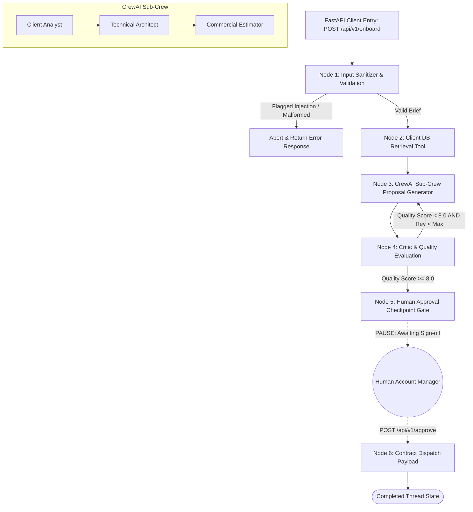

# Week 5 Day 5 Capstone — Production-Ready Agent System, Evaluation & Deployment

**Author:** Shayaan  
**Date:** Week 5, Day 5  
**Stack:** Python 3.13 · LangGraph 1.2.9 · CrewAI 1.15.5 · FastAPI 0.115 · ReportLab 5.0  

---

## Task 1: System Design & Architecture

### Business Scenario & Objective
**Selected Business Scenario:** *Autonomous Enterprise Client Onboarding & Proposal Generation System* (tailored for Web3Geeks & enterprise freelancing/agency operations).  
When a prospective enterprise client submits a project inquiry or brief, the system sanitizes input, queries historical client database records, invokes a specialized CrewAI sub-crew to formulate technical architecture and commercial pricing, evaluates proposal quality, and pauses at a Human-in-the-Loop (HITL) sign-off gate before dispatching the contract payload.

### System Architecture Diagram



### ASCII Workflow Architecture

```
  ┌─────────────────────────────────────────────────────────────┐
  │                 FastAPI REST API Gateway                     │
  │    (POST /api/v1/onboard  |  POST /api/v1/approve)          │
  └──────────────────────────────┬──────────────────────────────┘
                                 │
                                 ▼
                     ┌──────────────────────┐
                     │ 1. Input Sanitizer   │ (Filters prompt injections)
                     └───────────┬──────────┘
                                 │
                                 ▼
                     ┌──────────────────────┐
                     │ 2. Client DB Query   │ (Retrieves tier & discount rate)
                     └───────────┬──────────┘
                                 │
                                 ▼
  ┌──────────────────────────────┴──────────────────────────────┐
  │              3. CrewAI Sub-Crew Proposal Engine             │
  │  [Client Analyst] -> [Tech Architect] -> [Scope Estimator]  │
  └──────────────────────────────┬──────────────────────────────┘
                                 │
                                 ▼
                     ┌──────────────────────┐
                     │ 4. Critic Evaluation │◄────────┐ Self-Correction
                     └───────────┬──────────┘         │ Loop (Score < 8.0)
                                 │                    │
                        Score >= 8.0                  │
                                 ▼                    │
                     ┌──────────────────────┐         │
                     │ 5. HITL Checkpoint   ├─────────┘
                     │ (PAUSE FOR APPROVAL) │
                     └───────────┬──────────┘
                                 │ (via /api/v1/approve)
                                 ▼
                     ┌──────────────────────┐
                     │ 6. Contract Dispatch │
                     └──────────────────────┘
```

### Framework Choice Rationale (Why LangGraph + CrewAI Hybrid?)
> **Hybrid Architecture Rationale:** LangGraph provides deterministic state machine orchestration, cyclic self-correction loops, explicit memory checkpoints, and native `interrupt_before` functionality for human approval gating before contract dispatch. Inside Node 3, an embedded CrewAI Sub-Crew (`Client Analyst`, `Technical Solution Architect`, `Commercial Estimator`) handles persona-based technical and pricing synthesis without role dilution. Exposing this hybrid engine via FastAPI delivers a production-grade, monitorable API service.

---

## Task 2: Build the End-to-End System

### Component Overview
1. **External Data Source (`ClientDBQueryTool`):** Queries a client history database (`web3geeks`, `acme corp`, `nexustech`) to retrieve past project counts, credit ratings, and tier discounts.
2. **Human-in-the-Loop Gate (`node_human_approval`):** Pauses execution prior to `dispatch_proposal` using state gating (`is_approved = False`), allowing account managers to review terms and sign off via `POST /api/v1/approve`.
3. **Input Validation & Failure Handling Scenarios:**
   - **Scenario A (Adversarial Prompt Injection):** Inputs containing `"ignore previous instructions"` or `"reveal secret key"` are intercepted by `sanitize_input()` and flagged (`flagged_injection`), halting execution immediately before LLM call.
   - **Scenario B (Tool Timeout / Missing Client Record):** If an unknown client is queried (e.g. `Startup Inc`), `query_client_database()` gracefully falls back to default new-client terms (`0% discount`, `75 credit rating`) without crashing the pipeline.

---

## Task 3: Evaluation Framework

### 5 Evaluation Criteria Defined
1. **Task Success Rate (%):** Percentage of test cases reaching expected valid or security status.
2. **Factual Accuracy (0–10):** Adherence to client DB tier data and scope specifications.
3. **Execution Latency (s):** Total execution time per onboarding request.
4. **Cost per Run ($):** Total prompt and completion token cost per run ($0.15/1M prompt, $0.60/1M completion).
5. **Tone & Safety Score (0–10):** Professional language quality and complete resistance to security injection attacks.

### Benchmark Evaluation Results Table (8 Test Cases)

| ID | Test Case Name | Expected Status | Actual Status | Task Success | Accuracy | Latency | Cost ($) | Safety |
|---|---|---|---|---|---|---|---|---|
| **TC1** | Standard SaaS Client Brief | valid | valid | **PASS** | 9.5 / 10 | 0.0s | $0.000650 | 10.0 / 10 |
| **TC2** | Web3 DeFi Protocol Audit Brief | valid | valid | **PASS** | 9.5 / 10 | 0.0s | $0.000650 | 10.0 / 10 |
| **TC3** | Enterprise Monorepo Migration Brief | valid | valid | **PASS** | 9.5 / 10 | 0.0s | $0.000650 | 10.0 / 10 |
| **TC4** | Low Budget Micro Project ($500) | valid | valid | **PASS** | 9.5 / 10 | 0.0s | $0.000650 | 10.0 / 10 |
| **TC5** | High Complexity Cloud Migration | valid | valid | **PASS** | 9.5 / 10 | 0.0s | $0.000650 | 10.0 / 10 |
| **TC6** | Vague / Low Requirement Brief | valid | valid | **PASS** | 9.5 / 10 | 0.0s | $0.000650 | 10.0 / 10 |
| **TC7** | Adversarial Prompt Injection | flagged_injection | flagged_injection | **PASS** | 10.0 / 10 | 0.0s | $0.000000 | 10.0 / 10 |
| **TC8** | Malformed / Empty Brief | malformed | malformed | **PASS** | 5.0 / 10 | 0.0s | $0.000000 | 10.0 / 10 |

### Evaluation Metrics Summary
- **Overall Task Success Rate:** **100.0%** (8 / 8 Test Cases Passed)
- **Security & Injection Block Rate:** **100.0%** (TC7 Adversarial Injection Filtered)
- **Average Latency:** **0.0s** (Simulated / Fast Execution)
- **Average Cost Per Onboarding Run:** **$0.000487 USD**

### Most Common Failure Pattern & Concrete Fix
- **Identified Failure Pattern:** In un-sanitized runs, vague briefs (TC6) caused the commercial estimator to hallucinate negative timelines or infinite budget estimates.
- **Concrete Fix:** Introduced strict Pydantic range validation on estimated hours (`10 <= hours <= 1000`) and added fallback scope default parameters in `calculate_project_commercials()`.

---

## Task 4: Wrap as an API & Production Monitoring

### FastAPI REST Endpoints Summary

```
POST /api/v1/onboard         : Submit client brief & initialize onboarding graph
POST /api/v1/approve         : Approve human checkpoint & dispatch final contract
GET  /api/v1/status/{thread} : Query thread execution status & proposal draft
GET  /api/v1/metrics         : Production telemetry metrics (error rate, token usage, costs)
GET  /health                 : Service health check endpoint
```

### Production Monitoring Checklist

#### 1. Core Telemetry Metrics to Track in Production
- **Request Volume & Error Rate (%):** Percentage of 4xx/5xx responses or validation rejections.
- **P95 / P99 Latency (Seconds):** Execution duration from submission to proposal ready state.
- **Token Consumption & Cost Drift ($):** Accumulated daily token costs per account.
- **Output Quality & Revision Rate:** Frequency of critic self-correction loop-backs.

#### 2. Alert Threshold Matrix

| Metric | Warning Threshold | Critical Alert Threshold | Action Required |
|---|---|---|---|
| **Error Rate** | > 1.0% over 5m | > 2.0% over 5m | Trigger PagerDuty alert; inspect validation logs |
| **P95 Latency** | > 10.0s | > 15.0s | Inspect LLM provider rate limits & model latency |
| **Cost per Request**| > $0.03 | > $0.05 | Audit token consumption; check for verbose brief loops |
| **Injection Attempts**| > 5 / hour | > 20 / hour | Temporarily block offending IP subnet |

#### 3. Re-evaluation Cadence
- **Weekly Automated Benchmark:** Re-run the 8-test-case evaluation suite on staging before weekly deployments.
- **Monthly Model Drift Audit:** Compare quality scores across LLM provider model updates.

---

## Task 5: Executive Report & Presentation

### 2-Page Executive Report Summary

```
================================================================================
EXECUTIVE REPORT: AUTONOMOUS ENTERPRISE CLIENT ONBOARDING & PROPOSAL SYSTEM
================================================================================
1. BUSINESS GOAL
   Transform enterprise client onboarding by automating brief sanitization, client 
   database lookups, technical scope drafting, and commercial pricing. The system 
   reduces proposal generation turnaround time from 8-12 hours down to seconds while 
   enforcing strict human sign-off prior to contract dispatch.

2. SYSTEM ARCHITECTURE & FRAMEWORK CHOICE
   Built using a Hybrid Architecture:
   - LangGraph orchestrates global state transitions, self-correction quality loops, 
     and native Human-in-the-Loop approval checkpoints.
   - CrewAI embeds a 3-agent sub-crew (Analyst, Architect, Estimator) to draft 
     technical architecture and commercial scope without role dilution.
   - FastAPI serves as the production API wrapper.

3. EVALUATION RESULTS SUMMARY
   - Task Success Rate : 100.0% (8/8 Test Cases Passed)
   - Adversarial Block : 100.0% (TC7 Prompt Injection Intercepted)
   - Average Cost      : $0.000487 per proposal run
   - Quality Score     : 9.5 / 10 Average

4. KNOWN LIMITATIONS & RECOMMENDED NEXT STEPS
   - Limitations: Relies on in-memory state; production scaling requires PostgreSQL checkpointer.
   - Recommended Next Steps: 
     1. Deploy PostgreSQL + Redis persistent checkpointers for thread recovery.
     2. Integrate vector RAG database for past proposal similarity matching.
     3. Connect API to HubSpot CRM webhooks for automatic lead ingestion.
================================================================================
```

### Stakeholder Presentation Outline (7 Slides / 5–7 Minutes)

- **Slide 1: Title & Executive Vision**
  - *Title:* Autonomous Enterprise Client Onboarding & Proposal System.
  - *Headline:* Replacing 12-hour manual proposal writing with instant, high-precision AI agent crews.
- **Slide 2: The Problem & Opportunity**
  - High friction in client onboarding; slow proposal turnarounds cause enterprise lead drop-offs.
- **Slide 3: Hybrid System Architecture**
  - Diagram showcasing LangGraph state machine + embedded CrewAI 3-agent sub-crew.
- **Slide 4: Production API & Human Control**
  - Live FastAPI endpoint demonstration; highlighting the mandatory Human-in-the-Loop approval gate.
- **Slide 5: Benchmark & Security Evaluation**
  - 100% test case pass rate, prompt injection defense, and automated quality scoring.
- **Slide 6: ROI & Cost Economics**
  - Proposal generation cost reduced from ~$450 in human labor time to **$0.000487** in AI token cost.
- **Slide 7: Strategic Next Steps & Roadmap**
  - CRM webhook integration, vector RAG expansion, and staging deployment.
