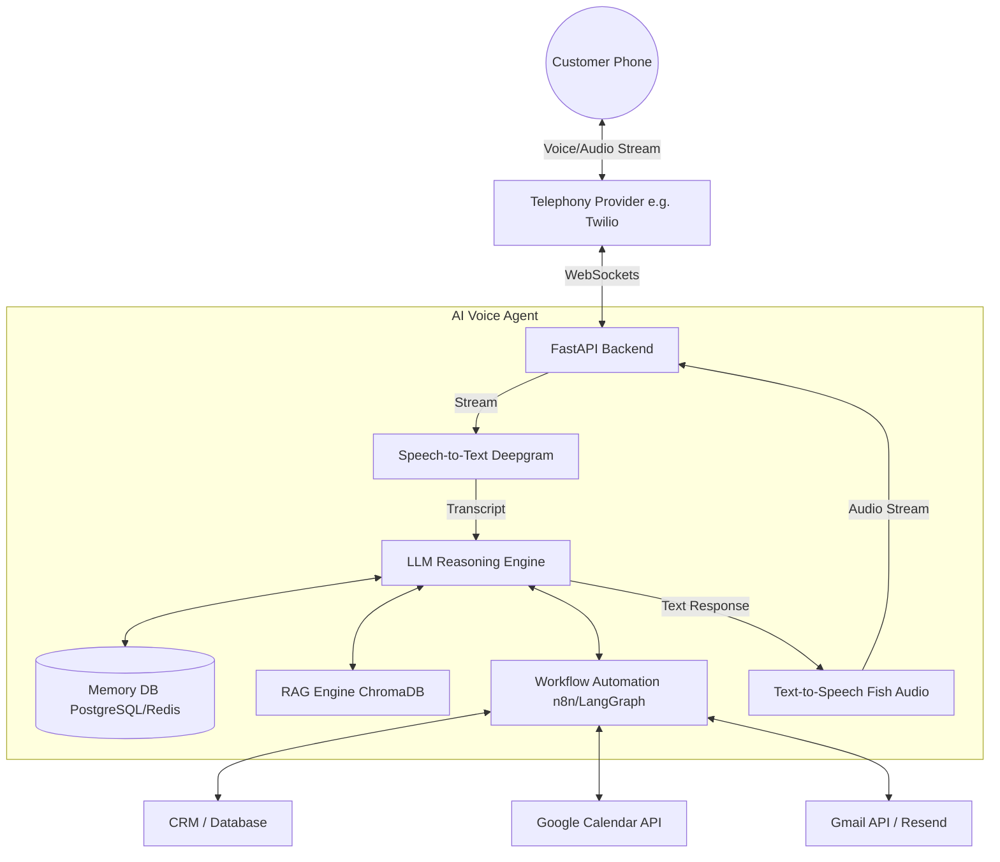

# AI Voice Agent Architecture

## Components Pipeline
1. **Telephony Layer**: Handles incoming calls (e.g., Twilio, Plivo). Routes audio streams via WebSockets.
2. **Speech-to-Text (STT) Pipeline**: Transcribes incoming audio streams in real-time (e.g., Deepgram, AssemblyAI).
3. **LLM Reasoning Engine**: Core intelligence processing transcripts, maintaining context, and determining responses. Uses OpenAI GPT-4o, Claude 3.5 Sonnet, or Gemini 1.5 Pro.
4. **Tool Calling & Workflow Orchestration**: LLM invokes external functions (e.g., Google Calendar API for booking, CRM via n8n or LangGraph for workflow execution).
5. **Retrieval-Augmented Generation (RAG)**: Fetches property details, policies, and FAQ answers from a Vector DB (e.g., ChromaDB, Pinecone).
6. **Memory Management**: Short-term conversational context (redis/in-memory) and long-term customer history (PostgreSQL/MongoDB).
7. **Text-to-Speech (TTS)**: Converts the LLM's text response back into natural, low-latency audio (e.g., Fish Audio, ElevenLabs).

## Architecture Diagram

