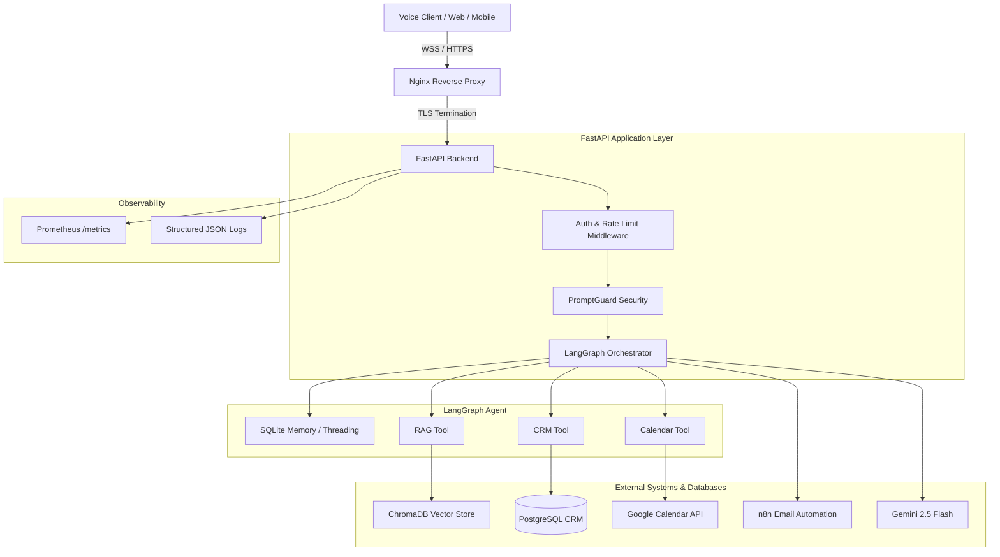

# System Architecture — NetixSol Real Estate AI Platform

This document describes the enterprise architecture for the NetixSol Real Estate Voice Agent Platform, designed for high availability, low latency, and maintainability.

## 1. High-Level Architecture

The platform follows a layered microservices architecture with a clear separation of concerns between ingress, security, orchestration, and integrations.

## 2. Component Design

### 2.1 Ingress & Proxy (Nginx)
- **Role:** Handles TLS termination, HTTP/2, WebSocket upgrades, gzip compression, and initial rate limiting.
- **Why Nginx:** Proven enterprise reverse proxy; prevents slow-loris attacks and offloads TLS overhead from Python.

### 2.2 Application Backend (FastAPI)
- **Role:** REST and WebSocket server.
- **Features:** 
  - Asynchronous event loop for handling thousands of concurrent connections.
  - Custom middleware for request correlation (`X-Request-ID`), rate limiting, and JWT/API-Key validation.
  - Three-tier health probes (`/live`, `/ready`, `/health`) for Kubernetes.

### 2.3 Orchestration Engine (LangGraph)
- **Role:** Manages the stateful conversation loop.
- **Workflow:** Detects intent, executes tools, handles failures gracefully, and generates final Urdulish responses. Maintains conversational context (memory) via thread checkpointing.

### 2.4 Security Layer (PromptGuard)
- **Role:** Defends against prompt injection and data exfiltration.
- **Design:** Two-stage check: Fast regex heuristics (stops 90% of attacks in <1ms) followed by an LLM semantic check for sophisticated jailbreaks.

## 3. Data Flow

### Call Flow: Inbound Voice Request
1. **Client** opens a WebSocket connection to `/v1/voice/ws/{session_id}`.
2. **Nginx** upgrades the connection and routes to **FastAPI**.
3. **Client** sends an audio chunk.
4. **FastAPI** translates audio to text (STT) and runs **PromptGuard**.
5. If safe, text enters **LangGraph**.
6. **LangGraph** queries **ChromaDB** for property context.
7. **LLM** generates response text.
8. **FastAPI** translates text to audio (TTS) and streams back to **Client**.

## 4. Deployment Architecture

The system is designed for **Kubernetes (K8s)** or **Docker Compose** deployments.

- **Stateless Tier:** FastAPI pods run as a K8s Deployment, auto-scaled via HPA based on CPU/Memory.
- **Stateful Tier:** PostgreSQL and ChromaDB run as StatefulSets or managed cloud services (e.g., AWS RDS, Pinecone).
- **Cache:** Redis handles cross-pod rate limiting and session state.

## 5. Security Posture

- **In Transit:** TLS 1.3 enforced at Nginx.
- **Authentication:** JWT tokens for web clients, API Keys for server-to-server.
- **Least Privilege:** Containers run as a non-root `appuser`.
- **Input Validation:** Pydantic models validate all incoming payload schemas.
- **LLM Safety:** Dedicated PromptGuard blocks injections before they reach the main orchestration prompt.
